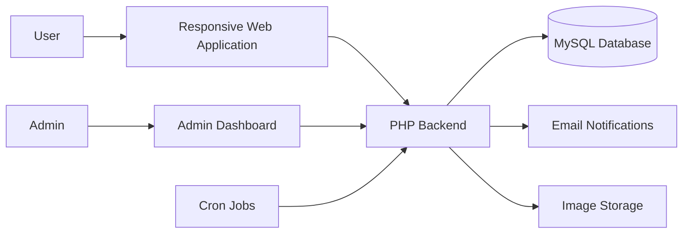
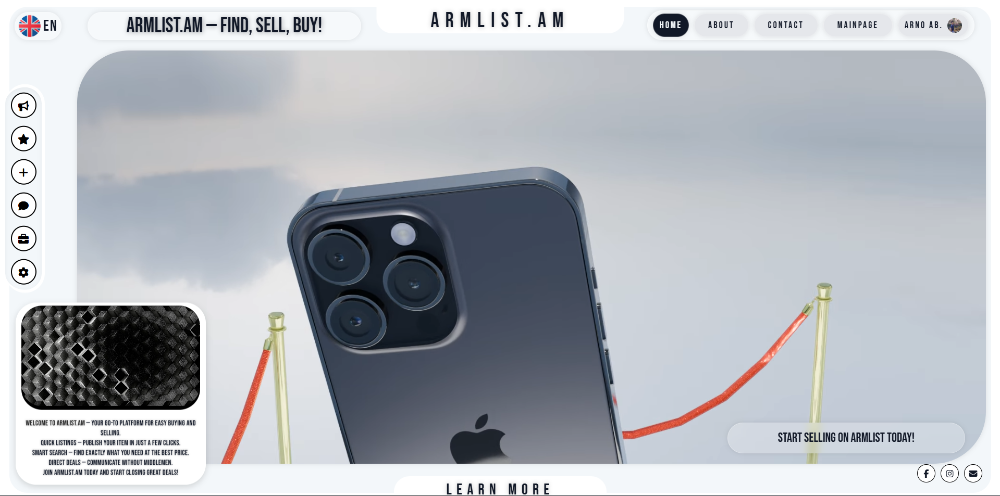
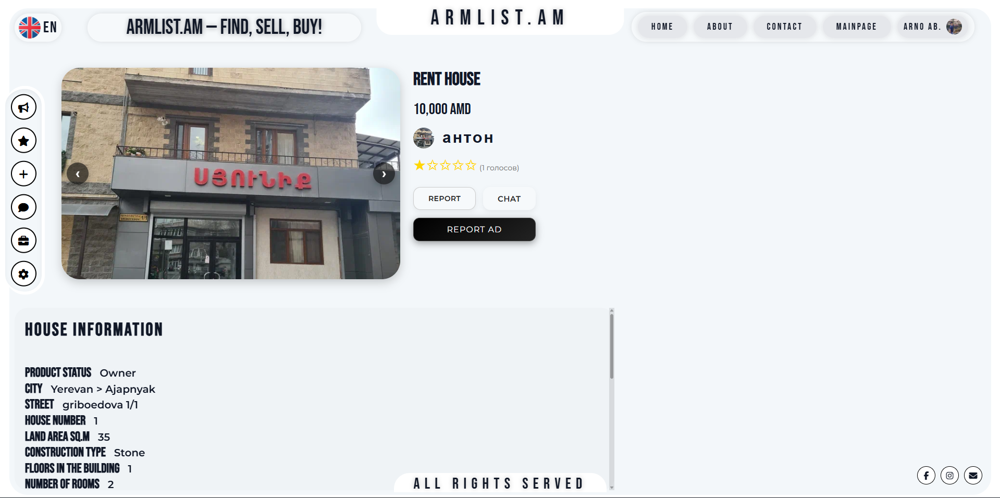
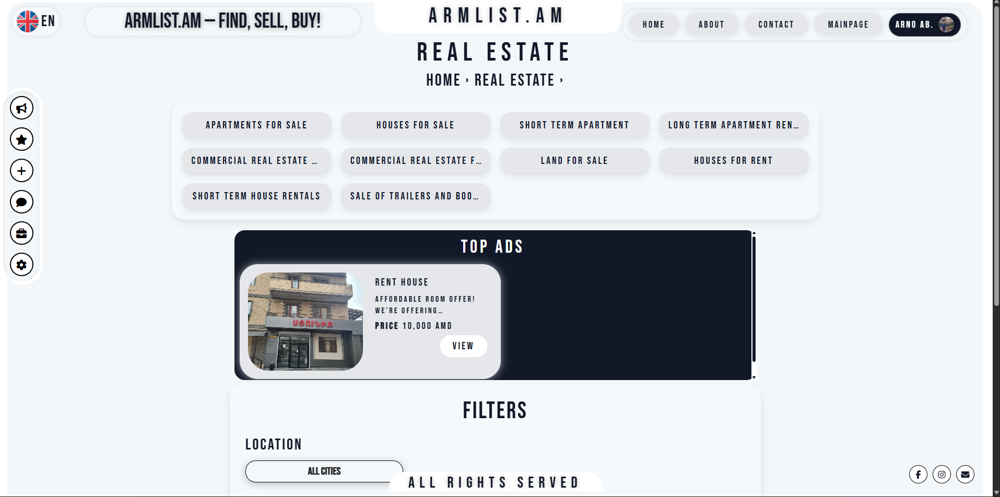
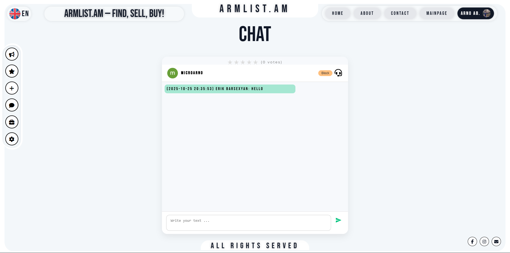
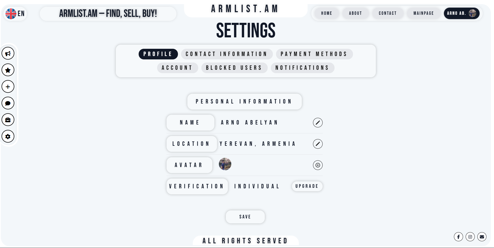

  

# ArmList

### Marketplace platform built for Armenia.

ArmList is a full-scale marketplace designed to connect buyers and sellers through a modern, structured and scalable platform.

  <a href="https://armlist.am"><strong>Visit Live Product</strong></a>
  ·
  <a href="https://webifybusiness.com"><strong>Built by Webify</strong></a>

> This repository is a public product overview.  
> The commercial source code and private infrastructure remain confidential.

---

## Overview

ArmList was designed as a complete marketplace ecosystem rather than a basic listings website.

The platform includes user accounts, product publishing, category-based search, premium placements, messaging, moderation, administration and automated notifications.

The product was built with a strong focus on usability, scalability and long-term business growth.

---

## Core Features

- User registration and authentication
- Product listings with categories and subcategories
- Image uploads and structured product data
- Premium and highlighted listings
- User profiles and seller information
- Internal messaging system
- Product moderation
- Reports and blocking
- Admin dashboard
- Email notifications
- Listing expiration management
- Account and session management
- Responsive interface

---

## Product Areas

### Marketplace

Users can publish, browse and manage listings across multiple categories.

### Messaging

The internal messaging system allows buyers and sellers to communicate directly inside the platform.

### Premium Placement

Listings can receive additional visibility through paid placement options and expiration-based promotion logic.

### Administration

The administration system supports moderation, users, listings, reports and platform management.

---

## Technology

### Frontend

- HTML
- CSS
- JavaScript

### Backend

- PHP
- MySQL

### Infrastructure

- Apache
- cPanel
- Cron Jobs
- PHPMailer
- Git

---

## Architecture

---

## My Role

- Product architecture
- Business logic
- Database design
- Backend development
- Frontend development
- Authentication and sessions
- Messaging system
- Admin dashboard
- Email automation
- Deployment
- Product iteration

---

## Gallery

  

<table>
<tr>
<td width="50%">
  
</td>
<td width="50%">
  
</td>
</tr>
<tr>
<td width="50%">
  
</td>
<td width="50%">
  
</td>
</tr>
</table>

---

## Status

**Production**

The platform is live and available at:

### https://armlist.am

---

  Built by <a href="https://webifybusiness.com"><strong>Webify</strong></a>

